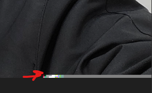
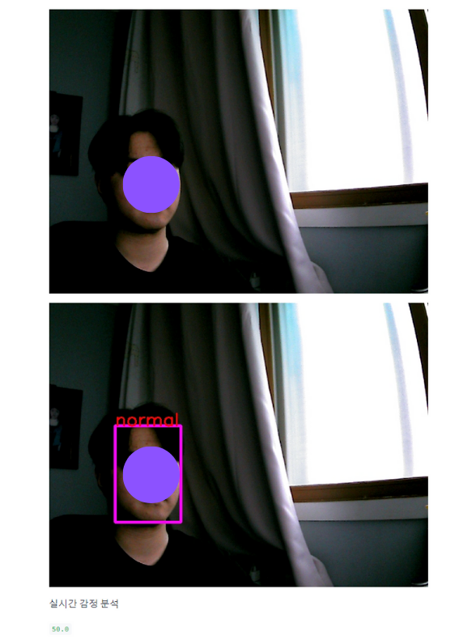
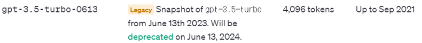
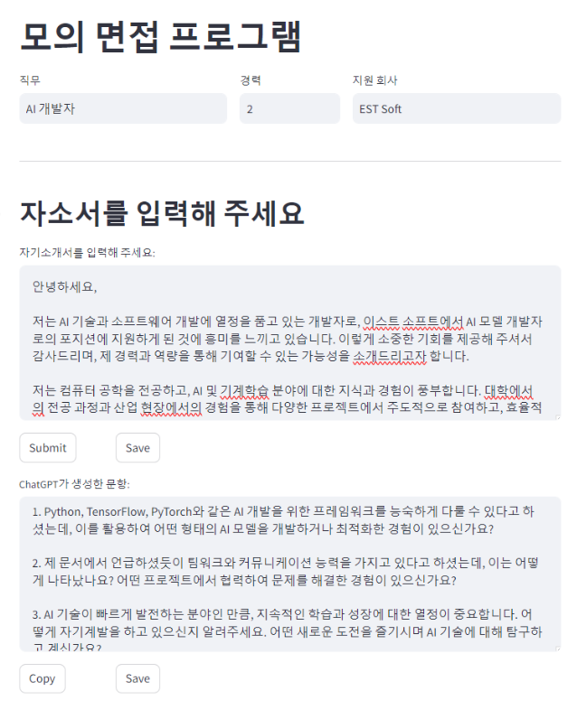
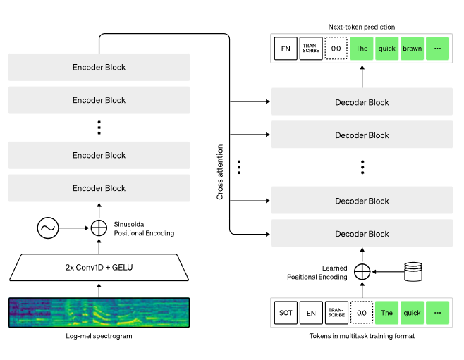
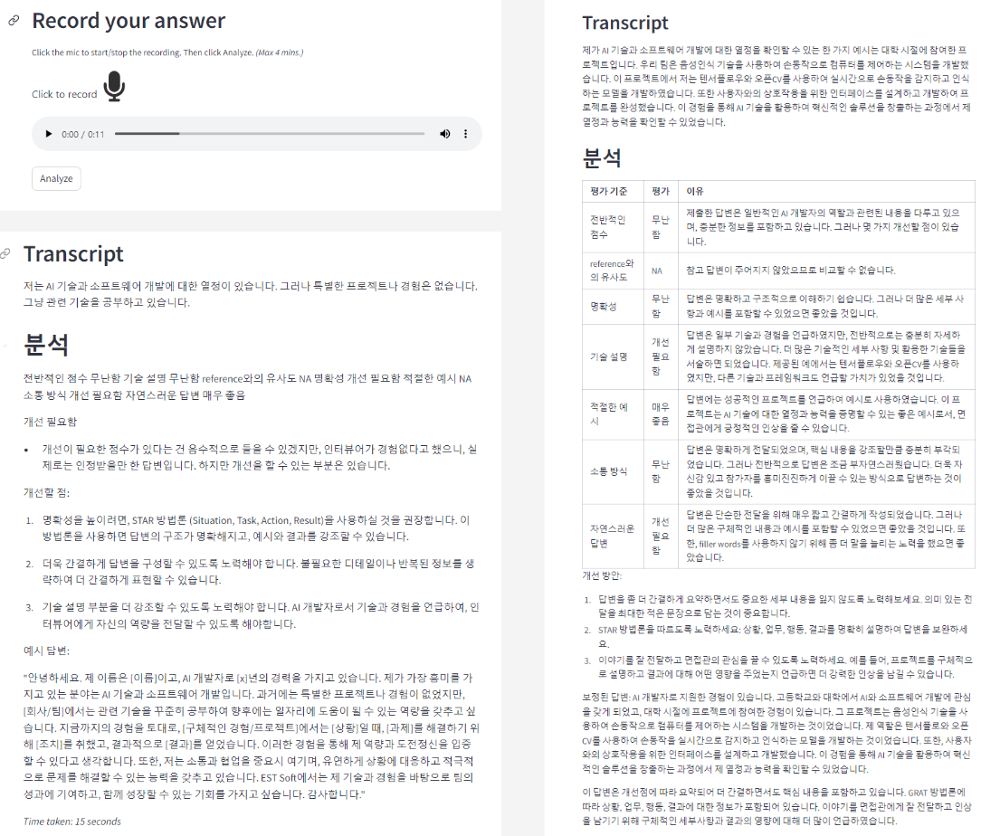
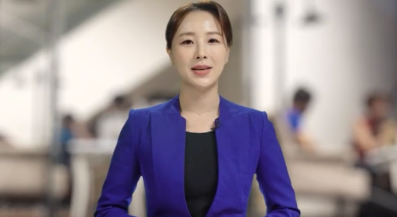

# Facial-Recognition-and-Emotion-Recognition-project
**Development of question generation and mock interview function based on model learning and self-introduction to recognize and classify facial emotions**

## Team Members 
- [김범찬](https://github.com/kimbeomchan97)
- [방서빈](https://github.com/vin10ah)
- [송승민](https://github.com/ssm7hannah) - `Leader`
- [한상준](https://github.com/hantoro123)

## Development environment settings

***Device - GPU*** : NVIDIA A100 80GB (x 4) <br>
***CUDA Version*** : 12.2<br>
***Storage*** : 2.0T


- requirements.txt
```bash
$ pip install -r requirements.txt
```

- mathai.yaml
```bash
$ conda env create -f mathai.yaml
$ conda activate mathai
```

### Modularization of each model
- `config` : Hyperparameter values required for each file
- `dataset` : It's made into a transformed image folder format dataset
- `model` : Each classification model
- `train` : Train for each model
- `plot` : Plot the accuracy, loss, and confusion matrix of the model
- `main` : where implementation is carried out comprehensively

## Origin Data tree
```bash
📦data
 ┣ 📂anger
 ┃ ┣ 📂labeled
 ┃ ┃ ┣ 📂train
 ┃ ┃ ┗ 📂validation
 ┃ ┗ 📂raw
 ┃ ┃ ┣ 📂train
 ┃ ┃ ┗ 📂validation
 ┣ 📂anxiety
 ┃ ┣ 📂labeled
 ┃ ┃ ┣ 📂train
 ┃ ┃ ┗ 📂validation
 ┃ ┗ 📂raw
 ┃ ┃ ┣ 📂train
 ┃ ┃ ┗ 📂validation
 ┣ 📂embarrass
 ┃ ┣ 📂labeled
 ┃ ┃ ┣ 📂train
 ┃ ┃ ┗ 📂validation
 ┃ ┗ 📂raw
 ┃ ┃ ┣ 📂train
 ┃ ┃ ┗ 📂validation
 ┣ 📂happy
 ┃ ┣ 📂labeled
 ┃ ┃ ┣ 📂train
 ┃ ┃ ┗ 📂validation
 ┃ ┗ 📂raw
 ┃ ┃ ┣ 📂train
 ┃ ┃ ┗ 📂validation
 ┣ 📂normal
 ┃ ┣ 📂labeled
 ┃ ┃ ┣ 📂train
 ┃ ┃ ┗ 📂validation
 ┃ ┗ 📂raw
 ┃ ┃ ┣ 📂train
 ┃ ┃ ┗ 📂validation
 ┣ 📂pain
 ┃ ┣ 📂labeled
 ┃ ┃ ┣ 📂train
 ┃ ┃ ┗ 📂validation
 ┃ ┗ 📂raw
 ┃ ┃ ┣ 📂train
 ┃ ┃ ┗ 📂validation
 ┗ 📂sad
 ┃ ┣ 📂labeled
 ┃ ┃ ┣ 📂train
 ┃ ┃ ┗ 📂validation
 ┃ ┗ 📂raw
 ┃ ┃ ┣ 📂train
 ┃ ┃ ┗ 📂validation
```


## Preprocessing

### 1. Truncated File Detection
<p align="center">
  
</p>
***truncated image file sample***

-  train : embarrass(#1), normal(#3)
- validation : anger(#2), embarrass(#1), happy(#4), pain(#1)
- **Excluding a total of 12 image files**

### 2. Split Dataset

||non_crop|non_crop|non_crop|crop|crop|
|:---:|:---:|:---:|:---:|:---:|:---:|
|train|1400|7000|28000|1400|7000|
|validation|700|2100|7000|700|2100|


### 3. Create data path and labels for Yolov8

```bash
📦data
┣ 📂train
┃  ┣ 📂images
┃  ┗ 📂labels
┣ 📂validation 
┃  ┣ 📂images
┃  ┗ 📂labels
┗ 📂test
   ┗ 📂images
``` 

# Part1 **Categorizing a person's feelings**

## Used model

### VGG

```bash
$ ~/model/vgg/$ python main.py
```
### ResNet

```bash
$ ~/model/vgg/$ python main.py 
```
### ResNeXt

```bash
$ ~/model/vgg/$ python main.py 
```
### ViT

```bash
$ ~/model/vgg/$ python main.py 
```

### Yolov8 - cls

```python
from ultralytics import YOLO

model = YOLO('yolov8n-cls.pt')  # load a pretrained YOLOv8n cldssification model
model.train(data='image_folder_path')

```

### Yolov8 - detection

```python
from ultralytics import YOLO

model = YOLO('yolov8m.pt')  # load a pretrained YOLOv8n cldssification model
model.train(data='yaml_file_path')

```


## Classification result 

**What is the best model?**
- Yolov8-cls

|Model|loss|acc|
|:---:|:---:|:---:|
|VGG|1.4069|0.4864|
|ResNet|1.6695|0.3563|
|ResNeXt|1.5422|0.4163|
|ViT|1.7797|0.3006|
|**Yolov8-cls**|**0.8322**|**0.6360**|


# Part2 ***나만의 One and Only 면접 코디 (with. 감정분류)***
***Simulation of interviews using AI***

- ***Cold job market***
- ***Alone person***
- ***Without time and place constraints***
- ***Create Customized Questions***

**UI**
- Streamlit

## Facial Detection

### Yolov8 - detection

- *Live analysis of interviews*

|***emotion***|anger|anxiety|embarrass|happy|normal|pain|sad|
|:---:|:---:|:---:|:---:|:---:|:---:|:---:|:---:|
|***Type***|Negative|Negative|Negative|Positive|Positive|Negative|Negative|

### How did you score your emotions?

```python
def emotion_score(score:50.0,emotion):
  '''
  Functions that give scores for each emotion

  agrs - score : float=50.0
       - emotion : list
  '''
  score = score
  good, bad = 0, 0
  threshold = 0.1 # initial threshold

  good += (threshold * (emotion.count('happy')) + threshold * (emotion.count('normal')))
  bad -=  (threshold * (emotion.count('anger')) + threshold * (emotion.count('embarrass')) + threshold * (emotion.count('anxiety')) + threshold * (emotion.count('pain')) + threshold * (emotion.count('sad')))
  print(emotion)

  # initial score range
  if score+good+bad > 70:
      print('good')
  elif score+good+bad > 40:
      print('normal')
  else:
      print('bad')

  print(score+good+bad)
  return score+good+bad
```

<br>
<p align="center" style="font-size:20px">
  Live Emotion Detection
</p>
<p align="center">
  
</p>

## Create Question

### GPT-3.5

- *Pretrained model* <br>
<p align="center">

</p>

### Prompts that match our needs
```python
SYSTEM_ANSWER_PROMPT = """You are an expert on generating 3 interview questions in Korean based on the provided 자기소개서 (self-introduction), a helpful bot who provides polished and professional questions which are commonly asked interview questions.
Your task is to understand the self-introduction provided by the user and then enhance the interview questions.
Also don't use heavy or complex words that are not typically used in human conversations.
"""
```
<br>
<p align="center" style="font-size:20px">
  Self-Introduction based questions 
</p>
<p align="center">

</p>

## Speech to Text & Evaluation Answer

### GPT-3.5
### OpenAI-Whisper
<p align="center">
  
</p>

<p align="center" style="font-size:20px">
  Answers to Questions 
</p>

<br>
<p align="center">
  
</p>
 
## Utilization

### You can combine part2's Simulation of interviews with ESTsoft's AI Human


<p align="center">
  
  <br>
  sources <a href="https://estsoft.ai/">ESTsoft</a>
</p>

<p align="center" style="font-size:25px">
  Creating AI Interviewers Using AI Human
</p>

<br><br><br>

<p align="center">
  
</p>

<p align="center" style="font-size:25px">
  Interviewer : Create questions based on letter of self-introduction
</p>
<br><br>
<p align="center">
  <br>
  sources <a href="https://kr.freepik.com/free-vector/videocalling-with-therapist_7775324.htm#query=%ED%99%94%EC%83%81%EB%A9%B4%EC%A0%91&position=3&from_view=keyword&track=ais&uuid=23a23605-caf4-490a-84ae-b02306b6ce7e">Freepik</a>
</p>

<p align="center" style="font-size:25px">
  Candidate : Practice listening to questions and telling answers
</p>

# Result


|Model|accuracy|precision|recall|f1_score|time(h)|
|:---:|:---:|:---:|:---:|:---:|:---:|
|VGG|0.4864|0.420|0.414|0.417|26|
|ResNet|0.3563|0.28|0.298|0.289|27.2|
|ResNeXt|0.4163|0.202|0.201|0.201|18.2|
|ViT|0.3062|0.307|0.308|0.307|14.6|
|Yolov8m-cls|0.69|0.63|0.62|0.625|approx 3|
|Yolov8m|0.5725|0.68|0.74|0.709|approx 3|

# Reference

[Whisper](https://openai.com/research/whisper)<br>
[Yolov8](https://docs.ultralytics.com/ko)
